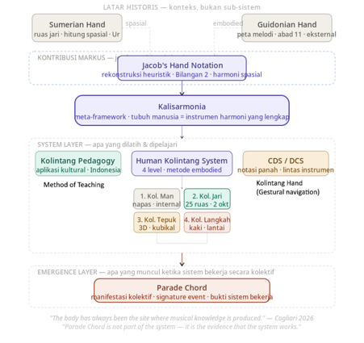

# Inclusive Music Education Toolkit

## Embodied, Spatial, and Inclusive Approaches to Musical Understanding

Created by **Soegiarto Hartono**

Deaf researcher, educator, cultural practitioner, and developer of embodied frameworks for music learning, cultural heritage, and inclusive participation.

Research Profiles:

* ORCID: 0009-0002-5648-0261
* ResearchGate: https://www.researchgate.net/profile/Soegiarto-Hartono

Current Academic Direction:

Preparing doctoral research in Transcultural Musicology in collaboration with Hochschule für Musik Franz Liszt Weimar, Germany (ongoing process).

Current Degree:

Master of Science in Information Technology (MSIT), University of the People (ongoing)

---

# Project Overview

The Inclusive Music Education Toolkit is an open educational and research initiative exploring how musical knowledge can be understood through embodiment, spatial relationships, participation, movement, and multisensory experience.

Rather than treating music solely as a system of sounds or symbols, this project investigates how musical understanding may emerge through the body itself.

The repository documents an evolving research program that integrates:

* embodied cognition
* inclusive music education
* Deaf-led innovation
* cultural heritage
* artistic research
* transcultural musicology

The long-term objective is to develop educational frameworks that make musical understanding more accessible while preserving intellectual and artistic rigor.

---

# System Architecture



The project is organized as a multi-layered framework.

Historical knowledge traditions provide context.

Jacob's Hand functions as a conceptual bridge.

Kalisarmonia serves as the central embodied meta-framework.

Multiple educational and musical systems emerge from Kalisarmonia and are explored through teaching, research, artistic practice, and community engagement.

---

# Historical Context

The project is informed by historical examples demonstrating how the human body has been used to organize and communicate knowledge.

Examples include:

* Sumerian finger-based counting traditions
* spatial approaches to number and relationship
* embodied educational practices
* the medieval Guidonian Hand

These historical examples are treated as sources of inspiration and context rather than direct prototypes.

---

# Jacob's Hand

Jacob's Hand is a scholarly reconstruction and conceptual bridge.

The framework explores how musical relationships may be understood through:

* spatial orientation
* relational thinking
* convergence and divergence
* embodied cognition
* hand-based representation

Jacob's Hand is not presented as a historical discovery.

It functions as a contemporary research framework that connects historical spatial traditions with the broader embodied system of Kalisarmonia.

Documentation:

docs/jacobs-hand.md

---

# Kalisarmonia

Kalisarmonia functions as the central meta-framework of the project.

The framework proposes that the human body itself may function as a complete instrument of musical understanding.

Within Kalisarmonia, musical knowledge emerges through relationships among:

* body
* movement
* space
* perception
* participation
* culture

Kalisarmonia provides the conceptual foundation from which multiple educational and musical applications emerge.

Documentation:

docs/kalisarmonia.md

---

# Human Kolintang System

The Human Kolintang System explores the possibility that the body itself may function as a living musical instrument.

Current areas of exploration include:

* Breath Kolintang
* Finger Kolintang
* Clapping Kolintang
* Walking Kolintang

Together, these embodied layers investigate rhythm, movement, orientation, coordination, and participation as foundations for musical understanding.

Documentation:

docs/human-kolintang-system.md

---

# Kolintang Hand

Kolintang Hand is an applied pedagogical framework inspired by Minahasan Kolintang practice.

The framework investigates how visual communication, embodied participation, and ensemble coordination may support inclusive music learning.

Areas of focus include:

* ensemble interaction
* role awareness
* visual communication
* embodied participation
* collaborative music-making

Documentation:

docs/kolintang-hand.md

---

# Directional Chord System (DCS)

The Directional Chord System explores harmonic understanding through movement and orientation.

Rather than focusing exclusively on chord labels, DCS investigates:

* directional movement
* harmonic navigation
* convergence and divergence
* visual representation
* spatial understanding

The framework is designed to support intuitive approaches to harmonic learning across different musical traditions and instruments.

Documentation:

docs/directional-chord-system.md

---

# Embodied Music Pedagogy

Embodied Music Pedagogy serves as the educational layer of the project.

The framework explores how musical understanding develops through:

* participation
* movement
* observation
* interaction
* embodied experience

This pedagogical perspective connects theoretical frameworks with practical teaching and learning environments.

Documentation:

docs/embodied-music-pedagogy.md

---

# Deaf-led Innovation

A central theme throughout the project is the recognition that accessibility can generate innovation.

Deaf-led innovation is approached not merely as accommodation but as a source of educational insight.

The project investigates how visual, tactile, spatial, and embodied forms of knowledge may contribute to richer educational experiences for diverse learners.

Documentation:

docs/deaf-led-innovation.md

---

# Publications

## Peer-Reviewed Publication

Hartono, S. (2025)

*Kolintang Minahasa: From Cultural Heritage to a Global Instrument in Inclusive Music Education and Cultural Diplomacy.*

Harmonia: Journal of Arts Research and Education (Scopus Q1)

---

## Additional Publication

Hartono, S. (2025)

*Reclaiming Somatic Intelligence: A Sumerian Minahasan Embodied Framework for Music Education in the AI Era.*

Journal of Music Theory and Transcultural Music Studies

---

# SAGE Research Methods Publications

Three peer-reviewed How-to Guides by Soegiarto Hartono were published in *SAGE Research Methods: Inclusive Research Methodologies* in June 2026.

## 1. Designing Multisensory Music Research for Disability Communities: Jacob's Hand Notation and Embodied Kolintang Pedagogy

SAGE Research Methods: Inclusive Research Methodologies
Publisher: SAGE Publications Ltd
Publication date: June 10, 2026
DOI: https://doi.org/10.4135/9781036247621

This guide presents Jacob's Hand Notation combined with Minahasan Kolintang pedagogy as a practical, multisensory methodology for inclusive music research. Grounded in embodied cognition and Minahasan cosmology, the method maps harmonic functions onto hand positions to make musical relationships accessible through touch and movement.

Official publication:

https://methods.sagepub.com/how-to-guide/designing-multisensory-disability-jacobs-kolintang-pedagogy

---

## 2. How to Enable Research Participation Through Body-Based Music: Working with Economically Marginalized Communities

SAGE Research Methods: Inclusive Research Methodologies
Publisher: SAGE Publications Ltd
Publication date: June 10, 2026
DOI: https://doi.org/10.4135/9781036249434

This guide introduces Guidonian Hand notation combined with Kalisarmonia as a body-based and participatory research methodology for economically marginalized communities. It demonstrates how embodied musical activities can support inclusive data generation, reflective inquiry, ethical research design, and meaningful participant engagement.

Official publication:

https://methods.sagepub.com/how-to-guide/enable-research-body-based-music-with-marginalized-communities

---

## 3. How to Use Directional Chord Symbols and Sumerian Counting for Inclusive Research Participation in STEM-Music Integration

SAGE Research Methods: Inclusive Research Methodologies
Publisher: SAGE Publications Ltd
Publication date: June 10, 2026
DOI: https://doi.org/10.4135/9781036249465

This guide demonstrates how Directional Chord Symbols (DCS) and Sumerian base-60 counting can be used as embodied methods for inclusive participation in STEM-music research. The approach emphasizes low-cost, multisensory, culturally responsive, and participatory forms of research engagement.

Official publication:

https://methods.sagepub.com/how-to-guide/how-to-use-directional-chord-symbols-sumerian-stem-music

---

# Repository Structure

```text
docs/
├── about-the-author.md
├── deaf-led-innovation.md
├── embodied-music-pedagogy.md
├── human-kolintang-system.md
├── jacobs-hand.md
├── kalisarmonia.md
├── kolintang-hand.md
├── directional-chord-system.md
└── resources.md

publications/
└── sage-research-methods.md

images/
└── kalisarmonia-system-architecture.png
```

---

# Project Status

This repository is an evolving research and educational project.

Materials may continue to develop through:

* artistic research
* conference presentations
* community engagement
* academic collaboration
* educational implementation

The repository documents an active research program, while individual frameworks and materials may continue to be revised and expanded as research progresses.

---

# Why Open Educational Resources?

Many innovative educational practices remain inaccessible because they exist only within workshops, classrooms, local communities, or unpublished teaching materials.

This repository seeks to document and share embodied approaches to musical understanding so that educators, researchers, students, and community practitioners can explore, adapt, and develop them further.

The project encourages:

* collaboration
* transparency
* interdisciplinary dialogue
* responsible adaptation
* inclusive participation

---

# Contact

Soegiarto Hartono

Email:

[petruskaseke@gmail.com](mailto:petruskaseke@gmail.com)

ORCID:

0009-0002-5648-0261

ResearchGate:

https://www.researchgate.net/profile/Soegiarto-Hartono

---

*"The body has always been the site where musical knowledge is produced."*
